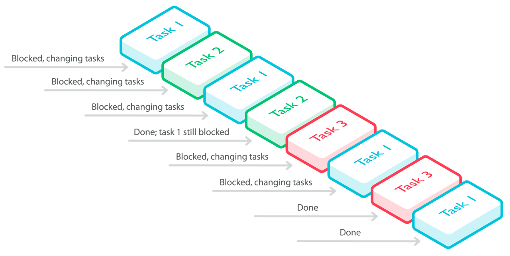

# Asynchronous programming

Asynchronous (or *async*) programming is a solution for working with multiple, potentially blocking, tasks. Async programming is an alternative to synchronous programming, where we must wait for a task to finish before moving on to the next task; and to multithread programming, which is more complicated to implement. 

In async programming we don't wait for blocking tasks to finish, but we also don't use multiple threads. Instead, within a single thread, we handle as many tasks as we can. We start with the first task. If that task is blocked, for example because it is waiting for input from a user or a component, we move to some other task. We continue with the new task until it finishes or is itself blocked, then try the first task again. If the first task is still blocked, we move on to other tasks, and so on. 

The following diagram shows a system handling three tasks in a single thread:

<span style="background-color: #F0F0F5; display:block; height:100%; padding:10px;"></span>

## An introduction to async on mbed OS

mbed OS is by default a single-threaded, event driven architecture. It relies on MINAR, a simple event scheduler that provides services for user and system events. Your application uses async by creating callbacks (functions that will be executed at a later time). Callbacks are scheduled using MINAR, which executes the callbacks based on their schedule parameters and [other considerations](#Managing-the-queue), and puts the MCU to sleep if there's nothing to run.

<span style="background-color:#E6E6E6;  border:1px solid #000;display:block; height:100%; padding:10px">**Note:** For most IoT applications, an event-driven paradigm is a very natural fit. However, for those applications that do require multithreading functionality, we intend to re-introduce it in 2016, after integrating it with our security and power management components.</span> 


## MINAR and event handlers

[MINAR](https://github.com/ARMmbed/minar) is the mbed OS event scheduler. Applications use it to control the execution of potentially blocking functions. 
#### MINAR and app_start()

mbed OS applications start with the [function ``app_start``](../Full_Guide/app_on_mbed_os.md#app_start-starting-the-application) (instead of ``main``). mbed OS starts MINAR's infinite event scheduler loop before ``app_start``, and the loop continues to run even after ``app_start`` exits.

### Blocking functions

A blocking function is one that can potentially run for a very long time, with the result that other functions can't run. For example, it might depend on getting information from a network server. If the actions of waiting for the server response and responding to it are both in the same function, the application will wait for the response, and won't be able to move on to the next action until the server responds. We won't be able to do anything:

```C++

app_start() {

ask_server_for_info;			// the application will hang here, waiting for the server
respond_to_server_information;

call to some_other_function; 		// we won't get to this function until 
// the blocking function is done
call to some_other_function;
call to some_other_function;
}

```

### Using asynchronous functions to avoid blocking behaviour

With asynchronous functions, a typical use case is to “split” any blocking action into three phases:

1. Initiation: we start the action by specifying its parameters (for example the address of the buffer where we read data from the network) and a callback.

1. Execution: the action is executed in the background and triggers a hardware interrupt upon completion. The interrupt handler schedules the callback specified by the user in the step above. The execution step is generally not visible from the user code.

1. Completion: MINAR calls the callback specified by the user in the first step. At this point, the asynchronous action is finished.

This is what the previous piece of code would have looked like if `ask_server_for_info` was an asynchronous operation:

```C++

app_start() {

ask_server_for_info(completion_callback);
// `ask_server_for_info` initiates the operation and returns immediately
// app_start exits and control goes back to MINAR
}

completion_callback() {
// the operation completed, an interrupt was fired and `completion_callback` was scheduled into MINAR as a result. 
// Program flow resumes here.
call to some_other_function;
call to some_other_function;
call to some_other_function;
}

```
### Inputs and interrupt handlers for MINAR

To avoid blocking functions, we don't trigger a function until we get the input it needs. Instead, we use interrupt handlers: events triggered by a physical interrupt from an MCU peripheral. The input's arrival is the very action that adds the function to MINAR:

```C++

// create input of type button

// create function that requires button press

interrupt_handler(){
	minar::Scheduler::postCallback(function_that_relies_on_input);
}

void app_start(int, char**){

// Set up the interrupt handler for the button and return. No need to wait for the
// button to be pressed in a busy waiting loop.
}

```

We'll see an example of [an interrupt handler](#a-single-event-from-an-interrupt-handler) later.

### Function pointers and binding in MINAR

mbed OS uses function pointers. The functionality comes from ``core-util/FunctionPointer.h``, which includes ``FunctionPointerBase.h`` and ``FunctionPointerBind.h``.

In MINAR, an event is a pointer to a function, plus a specific binding of the function's arguments. The event is created from a ``FunctionPointer`` by calling its ``bind`` method. ``bind`` takes a set of fixed values for the function's arguments (if the function has arguments) and creates a ``FunctionPointerBind`` instance. ``FunctionPointerBind`` keeps a copy of those fixed values and allows us to call the function later with those fixed arguments without having to specify them again. Here's an example:

```C++
FunctionPointer1<void, const char*> fp(cb_msg_and_increment);

// Schedule this one to run after a while

minar::Scheduler::postCallback(fp.bind("postCallbackWithDelay..."))
	.delay(minar::milliseconds(5000))
	.tolerance(minar::milliseconds(200))
```

The size of storage for the argument's values in ``FunctionPointerBind`` is fixed, which means that all ``FunctionPointerBind`` instances have the same size in memory. If the combined size of the arguments of ``bind`` is larger than the size of storage in ``FunctionPointerBind``, you'll get a compiler error.

A MINAR event is simply a ``FunctionPointerBind`` for functions that don't return any arguments:

```C++
typedef FunctionPointerBind<void> Event;
```

In conclusion, you can schedule any kind of function with various arguments by instantiating the [proper ``FunctionPointer`` class](#function-pointers-by-number-of-arguments-for-binding) with that function and then calling ``bind`` on the ``FunctionPointer`` instance. This will work so long as the function doesn't return anything and the total storage space required for its arguments is less than the fixed storage size in ``FunctionPointerBind``.

#### Function pointers by number of arguments for binding

Function pointers in mbed OS can have between zero and three arguments, and the binding is performed in ``FunctionPointer.h`` by one of four classes: 

* ``FunctionPointer0`` - a class for functions with no arguments.
* ``FunctionPointer1`` - a class for functions with one argument.
* ``FunctionPointer2`` - a class for functions with two arguments.
* ``FunctionPointer3`` - a class for functions with three arguments.

We'll explore function pointers in greater detail in [our examples](#function-pointers-with-different-argument-numbers).

#### Using temporary objects as MINAR events 

An important thing to keep in mind is that **events are passed to MINAR by value**. When MINAR receives an event, it will make a copy of the event in an internal storage area, so even if the original event object gets out of scope, MINAR will still be able to call the corresponding function with its correct arguments later. This means that you don't have to worry if the event object goes out of scope after you call ``postCallback``, so it's safe to use temporary objects.

Be careful though: MINAR only keeps a copy of the event instance itself and nothing else outside that. If the event is bound to an object that goes out of scope before the event is scheduled, your program will likely not behave as expected (and might even crash).

```C++
class A {
public:
	A(int i): _i(i) {
	}

 	int f() {
	 	printf("i = %d", _i);
 	}

private:
 	int _i;
};

void test() {
 	A a(10);
 	// The intention is to call a.f() after 100ms
 	
 	minar::Scheduler::postCallback(FunctionPointer0<void>(&a, &A::f).bind()).
 		delay(minar::milliseconds(100));
 	
 	// 'test' will exit immediately after `postCallback` above finishes
	// and 'a' will go out of scope. 100ms later, MINAR will try to call
	// 'A::f' on an instance that does not exist anymore ('a'), which leads
	// to undefined behaviour.
}
```


## How MINAR schedules tasks

mbed OS uses MINAR in the background to schedule system tasks, but if you want to use it with your own functionality, you have to explicitly call it and add tasks to its queue.

#### MINAR general scheduling logic

A simplified explanation of MINAR is that, at any given time, it can do one of three things: add a task to its queue, run a task from the queue, or put the MCU to sleep. 

* MINAR adds every task to its internal event queue as a first step. Tasks in MINAR are always ordered by their execution deadline.

* MINAR will run a task that has reached the head of the queue if its execution deadline was reached.

* MINAR will put the MCU to sleep only if it can't run any task, either because the queue is empty or because it’s not yet the execution deadline for the task at the head of the queue.

### MINAR implications for application code

MINAR is not a pre-emptive scheduler - it gets control back from an event only when that event exits, not while the event is running. This means it's not a real-time scheduler. 

The implications are:

* Keep your events as short as possible, or they will delay other events. 

* Don't use infinite loops. There is a single infinite loop in the system: the MINAR event loop. Any other infinite loop (in the user code or libraries) would cause MINAR to stop running.

* Don’t queue a function that needs data that is not available yet. For example, don’t queue a function that displays data received from the serial port until the data is available, because that requires blocking until the data is read from the port.

### Managing the queue

It's important to understand how MINAR manages the queue before writing applications. MINAR is designed to optimize power consumption, but because it also tries not to take control of the application away from you, it is programmable - leaving you with some responsibility. 

#### Scheduling parameters (event attributes) and ticks

When we add a task to MINAR's queue, we can use three parameters that give MINAR more information about scheduling the task:

* ``period``: the event will run periodically, with the specified interval. If the period is not specified, the event will run only once.
* ``delay``: the event will be executed after the specified delay.
* ``tolerance``: how long before or after the desired execution time the event can run. This helps MINAR optimize power consumption. Please note that the default tolerance value - the one used if you do not specify one yourself - is not 0; the value is set in ``minar.cpp``.

<span style="background-color:#E6E6E6;  border:1px solid #000;display:block; height:100%; padding:10px">**Tip**: The parameters are expressed in ticks (see below).</span>

The call to MINAR treats the parameters as attributes of the callback event. Our [code samples](#a-single-event-from-an-interrupt-handler) will show how to use these correctly.

Boards measure intervals with ticks. Because different boards have different tick durations, and we want our code to work the same on every board, we don't want to use ticks directly. Instead, MINAR knows how to interpret regular time - in milliseconds - to board-specific ticks. The function `minar::milliseconds` can be used to convert between ticks and milliseconds. If you need to convert from milliseconds to ticks, you can use `minar::ticks`

## How to add a task to MINAR's queue

To show how to use interrupts with MINAR, we're going to create an application that uses a GPIO input (a button) to turn the LED on our board on and off. Because we don't know when we'll press the button, we can't simply schedule the function that blinks the LED to run as soon as the app starts - we'll get stuck in that function. Instead, we'll create an interrupt handler to respond to the physical interrupt coming from a button press. The interrupt handler itself will send the LED toggle function to MINAR, and MINAR will schedule it to run. 

<span style="background-color:#E6E6E6;  border:1px solid #000;display:block; height:100%; padding:10px">**Tip:** Get the [code for this example here](https://github.com/ARMmbed/example-mbedos-interruptin). The code is functional and you can [build and run it on your board](../FirstProjectmbedOS.md).</span>

### A single event from an interrupt handler

This is the complete code for an application that turns the LED on our board on and off when we press a button.

#### The code

```C++

#include "mbed/mbed.h"

static DigitalOut led(LED1);

static void toggle_led(void) {
    led = !led;
}

static void switch_pressed(void) {

	/* Each time the switch is pressed, MINAR calls toggle_led.
	Since it's called by MINAR, toggle_led will run in user context,
	unlike 'switch_pressed' which runs in interrupt context. */

	minar::Scheduler::postCallback(toggle_led);

	/* In this case, calling 'toggled_led' directly from this function
	(in an interrupt context) would've worked fine, since that's a	
	very fast function and doesn't introduce race conditions. */
}

void app_start(int, char**) {
	static InterruptIn user_sw(SW2);
	user_sw.rise(switch_pressed);

	/* 'app_start' will exit at this point, but MINAR will continue to run
	after 'app_start' exits. Note though that 'user_sw' needs to be
	declared 'static', otherwise it'll get out of scope when 'app_start'
	exits, which is clearly not what we want. */
}

```

<span style="background-color:#E6E6E6;  border:1px solid #000;display:block; height:100%; padding:10px">**Note:** Including ``mbed.h`` implicitly includes ``minar.h``; there is no need to explicitly include any MINAR libraries and headers.</span>

#### Using postCallback to add an event to the queue

To schedule an event, we call the ``postCallback`` function in MINAR. For example, in the function ``switch_pressed``:

```C++
minar::Scheduler::postCallback(toggle_led);

```

``postCallback`` adds the event to MINAR's queue. 

This is a very simple call, because the ``toggle_led`` function doesn't accept parameters, and we didn't want to send event parameters to MINAR, either. Our [next example](#multiple-events) will show a more complicated use of ``postCallback``.

#### Potential blocking functions

Here's an example of a blocking function:

1. Call ``switch_pressed`` as soon as the application starts.
1. In ``switch_pressed``, define a change in the switch status as a condition for the function's completion.
1. Define an action, like a LED toggle.

The reason this function is blocking is that it can't get past step 2 until the user interacts with the switch and changes its status.

In mbed OS applications, we don't want blocking functions. The correct way to handle input-dependent functions is to schedule them only when their input arrives. In this example, we used ``InterruptIn`` to do that.

#### InterruptIn

``InterruptIn.h`` is part of ``mbed-drivers``. It associates its functionality with a pin-name, based on the board's ``PinNames.h``. We'll see the details of ``PinNames.h`` in our GPIO implementation example (which will be published soon). 

The pin name we provided here is SW2. On the FRDM-K64F, SW2 is mapped to PTC6, which we can find on the board's pinout.

So the line ``static InterruptIn user_sw(SW2);`` creates an association between SW2/PTC6 and the functionality of ``InterruptIn``. It creates it on an instance called ``user_sw``. 

The InterruptIn's functionality we're using here is ``rise``: ``user_sw.rise(switch_pressed)``. It detects a rising edge on the input. The response to that rising edge is to call the function ``switch_pressed``.

#### Using InterruptIn to call functions in a non-blocking manner

The important thing here is that the function ``switch_pressed`` isn't called at some random time; it's called only when a signal arrives from the input on SW2. In other words, ``switch_pressed`` - which requires the input to complete its run - is called only when it can run fully. 

We can see this easily by comparing the main function - ``app_start`` - of this example with our [standard Blinky example](../FirstProjectmbedOS.md) (which turns the LED on and off periodically, without user input):

__Blinky__

```C++
void app_start(int, char**){    minar::Scheduler::postCallback(blinky).period(minar::milliseconds(500));
}
```

__Current example__

```C++
void app_start(int, char**) {
	static InterruptIn user_sw(SW2);
	user_sw.rise(switch_pressed);
}
```

Blinky isn't waiting on input, so the first (and only) action of the main function is to call MINAR. Our current example, on the other hand, doesn't directly call MINAR at all - it sets up an interrupt handler, which calls the function that calls MINAR (``switch_pressed``) when the button is pressed.

#### MINAR when app_start() exits

In mbed Classic, waiting for an event was only possible while ``main`` (or some other function in the application) was running. To be able to work with event handlers, we kept ``main`` running using infinite loops:

```C++
while (true) {
	object.waitForEvent();
}

```

But in mbed OS, as we explained earlier, the scheduler MINAR is independent of the main function (``app_start``): it starts before ``app_start`` begins, and continues after ``app_start`` exits. This means that ``app_start`` can safely exit.

Our use of event handlers and function pointers (which we'll explore again in the next example) means that MINAR will know what to do when the button on the board is pressed. 

So although we used a very simple example, we saw a few important MINAR principles, not least that MINAR saves us the trouble of writing infinite loops (in fact, MINAR can't work properly if there's an infinite loop in our code). The next example will show more complicated calls.

### Multiple events

To see a bit of the potential of async programming with MINAR, let's look at the one of MINAR's test programs - [the complex dispatch](https://github.com/ARMmbed/minar/blob/master/test/complex_dispatch.cpp). 

#### The code

```C++

#include <stdio.h>
#include "minar/minar.h"
#include "mbed/mbed.h"
#include "mbed/test_env.h"
#include "mbed-util/FunctionPointer.h"

using mbed::util::FunctionPointer0;
using mbed::util::FunctionPointer1;

// Lots of code that includes the functions that will be called later: callback_no_increment, callback_and_increment, cb_msg_and_increment

static void stop_scheduler() {
    printf("Stopping scheduler...\r\n");
    minar::Scheduler::stop();
}

void app_start(int, char*[]) {

// [lots of code]

// The next callback will run once
	minar::Scheduler::postCallback(FunctionPointer0<void>(&led1, &LED::callback_no_increment).bind())
		.delay(minar::milliseconds(500))
		.tolerance(minar::milliseconds(100));

	// The next callback will be the only periodic one
	minar::Scheduler::postCallback(FunctionPointer0<void>(&led2, &LED::callback_and_increment).bind())
		.period(minar::milliseconds(650))
		.tolerance(minar::milliseconds(100));

	FunctionPointer1<void, const char*> fp(cb_msg_and_increment);
	// Schedule this one to run after a while
	minar::Scheduler::postCallback(fp.bind("postCallbackWithDelay..."))
		.delay(minar::milliseconds(5000))
		.tolerance(minar::milliseconds(200));

	// Schedule this one to run immediately
	minar::Scheduler::postCallback(fp.bind("postImmediate"))
		.tolerance(minar::milliseconds(200));

	// Stop the scheduler after enough time has passed
	minar::Scheduler::postCallback(stop_scheduler)
		.delay(minar::milliseconds(30000))
		.tolerance(minar::milliseconds(3000));

	int cb_cnt = minar::Scheduler::start(); // this will return after stop_scheduler above is executed

// [lots of code]
}

```

<span style="background-color:#E6E6E6;  border:1px solid #000;display:block; height:100%; padding:10px">**Note:** This example shows only the sections of the code relevant to MINAR. If you want to see the full code, please see the [GitHub repository](https://github.com/ARMmbed/minar/blob/master/test/complex_dispatch.cpp).</span>

#### Function pointers with different argument numbers

This example uses two of the [function pointer classes we introduced earlier](#function-pointers-by-number-of-arguments-for-binding): one for a function with zero arguments, and one for a function with a single argument.

To use the functions without cluttering up the code, we start by declaring ``mbed::util``:

```C++
using mbed::util::FunctionPointer0; // for a function with zero arguments
using mbed::util::FunctionPointer1; // for a function with one argument
```

We could then use ``FunctionPointer0`` and ``FunctionPointer1`` as shorthand:

```C++
minar::Scheduler::postCallback(FunctionPointer0<void>
	(&led1, &LED::callback_no_increment).bind())
	.delay(minar::milliseconds(500))
	.tolerance(minar::milliseconds(100));

```

#### MINAR event attributes

This example uses the attributes we introduced earlier to schedule a series of callbacks.

```C++
// The next callback will run once, after a delay
	minar::Scheduler::postCallback(FunctionPointer0<void>(&led1, &LED::callback_no_increment).bind())
		.delay(minar::milliseconds(500))
		.tolerance(minar::milliseconds(100));

// The next callback will run periodically
	minar::Scheduler::postCallback(FunctionPointer0<void>(&led2, &LED::callback_and_increment).bind())
		.period(minar::milliseconds(650))
		.tolerance(minar::milliseconds(100));
```

You have to remember that MINAR will not run one callback if another callback is executing. That means that when you design the callback sequence, it's important to take into account their performance time, delay and tolerance. Because the first callback in our example has a delay of 500ms and a tolerance of 100ms, it could take up to 600ms to start running. We therefore gave the next callback a period of 650ms and a tolerance of 100ms, meaning its first run can start 750ms after the first callback without causing problems.
