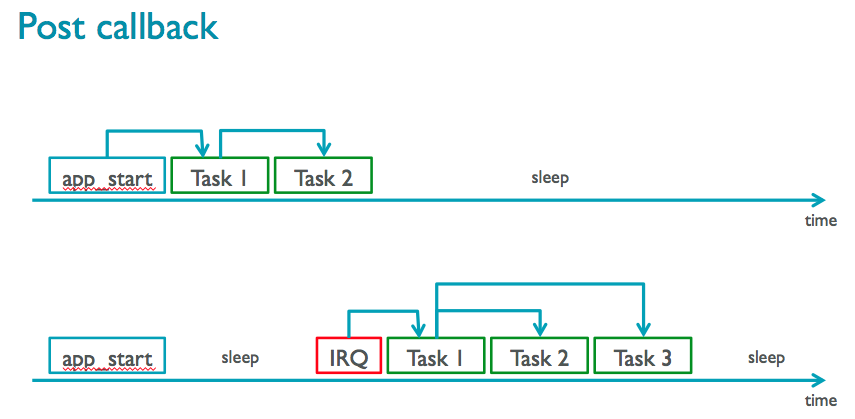
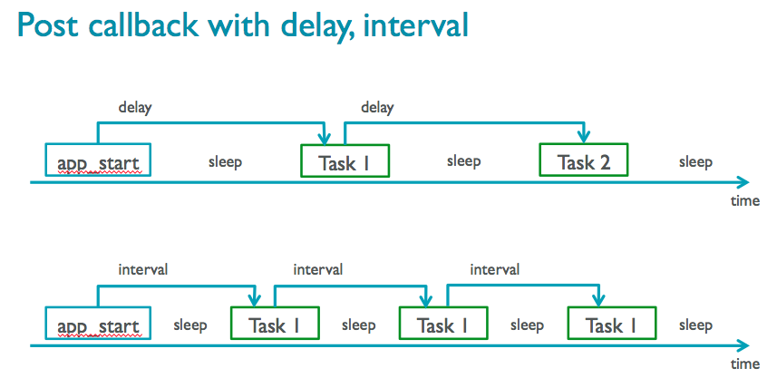
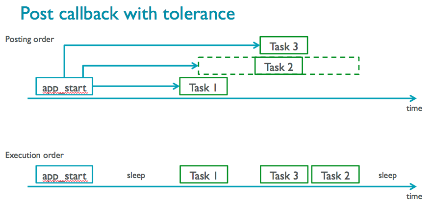
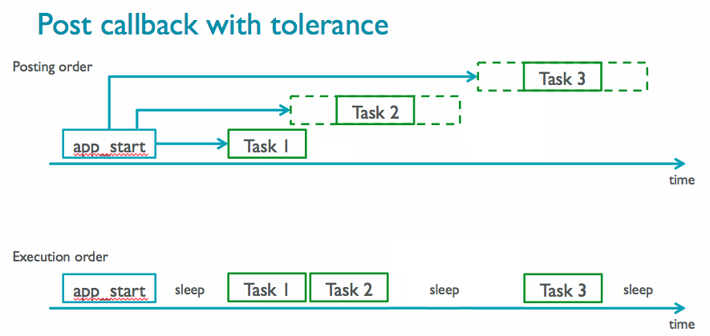

# Introduction to using MINAR

MINAR is a component in mbed OS for scheduling code to run later, either after a timeout or periodically. The act of scheduling code to be run later is called **posting** a callback.

Typically on embedded systems, you might use interrupts and timers to do this, but then your code runs in interrupt context and tasks are not serialised, adding complexities around locking and exclusion. Using MINAR, code runs in thread mode:

 * Cooperatively multi-tasking, MINAR is not an RTOS.
 * Tasks don’t interrupt each other.
 * Tasks run to completion.
 * Tasks can be posted from interrupt handlers and other tasks.


The starting point for scheduling code to run later is the `postCallback` function
```c
minar::Scheduler::postCallback(callbackTask);
```

## Run code some fixed time later

The following code example runs a function five seconds after initializing:

```c
#include "mbed-drivers/mbed.h"


static void blinky(void) {
    printf("5 second later!");
}   

void app_start(int, char**){
    printf("Hi");

    // Run a task in 5 seconds
    minar::Scheduler::postCallback(blinky).delay(minar::milliseconds(5000));
}   
```
Tolerance is how sensitive your task is to being run at the exact scheduled time. MINAR will decide when to run a task (the current workload permitting) based on the scheduled time plus/minus the tolerance. By default the tolerance is 50ms:

```c
minar::Scheduler::postCallback(blinky)
	.delay(minar::milliseconds(5000)     // the postCallback method returns an object that lets us set more parameters
	.tolerance(minar::milliseconds(100)); // so now we can also set the tolerance
```

## Run code periodically

The following example, which is the same as the [mbed OS Blinky example](https://github.com/ARMmbed/example-mbedos-blinky), uses `minar` to run a callback periodically:

```c
#include "mbed-drivers/mbed.h"

// If we use the Scheduler class we simplify our code later on
using minar::Scheduler;

DigitalOut led(LED1);

static void blinky(void) {
    led = !led; 
}   

void app_start(int, char**){

    // we don't need minar:: here because of the 'using' line above'
    Scheduler::postCallback(blinky).period(minar::milliseconds(500));

}   

```

## Perform a task when a button is pressed

This example uses the InterruptIn class from mbed, but defers all the work to MINAR in thread mode:

```c
#include "mbed-drivers/mbed.h"

InterruptIn button(BUTTON1);
DigitalOut  led(LED1);

// If we use the Schedur class from the minar namespace we simplify our code later on
using minar::Scheduler;

void buttonTask() {
    printf("Hello mbed!");
    led = !led;
}

void buttonISR() {
    Scheduler::postCallback(buttonTask);
}

void app_start(int, char *[]) {
    button.fall(buttonISR);
}
```

## Cancel a callback

In order to cancel a callback that we've previously scheduled, we need a handle to it. We can do this by calling the getHandle() method on the object returned by postCallback.

```C++
#include "mbed-drivers/mbed.h"

using minar::Scheduler;

InterruptIn button(p17);
DigitalOut  led(p22);

static minar::callback_handle_t handle = 0;

static void blinky(void) {
    led = !led;
}

void buttonTask() {
    Scheduler::cancelCallback(handle);
    handle = 0;
}

void buttonISR() {
    Scheduler::postCallback(buttonTask);
}

void app_start(int, char**){
    button.fall(buttonISR);
    handle = Scheduler::postCallback(blinky)
              .period(minar::milliseconds(500))
              .getHandle();
}
```


The following images show the relationship between MINAR event attributes and the execution order of callbacks:
  
  * Compare tasks that aren't posted by an interrupt with tasks that are posted by an interrupt (note that the system sleeps while waiting for the IRQ):

<span style="background-color: #F0F0F5; display:block; width:75%; padding:10px;"></span>
  
  * Tasks with delays, and a single task with intervals:

<span style="background-color: #F0F0F5; display:block; width:75%; padding:10px;"></span>
  
  * You can use tolerance to optimize MINAR's scheduling, because a task with low tolerance will push ahead of tasks with higher tolerance. Tasks are ordered in the queue by the last possible time to run them. Task 3 runs before Task 2, because Task 3 has no tolerance - its last possible executable time is earlier than Task 2's last possible executable time:

<span style="background-color: #F0F0F5; display:block; width:75%; padding:10px;"></span>
  
  * Tolerance can be used to prevent the MCU from going to sleep, but not to wake it up. Task 2 is performed right after Task 1, because the MCU is already running and Task 2's tolerance allows it to run this early. But Task 3 happens after a sleep (its scheduled time), because its tolerance isn't big enough to push it to the end of Task 2, and so the MCU goes to sleep - and will not wake up to run something earlier than its scheduled execution time:

<span style="background-color: #F0F0F5; display:block; width:75%; padding:10px;"></span>
