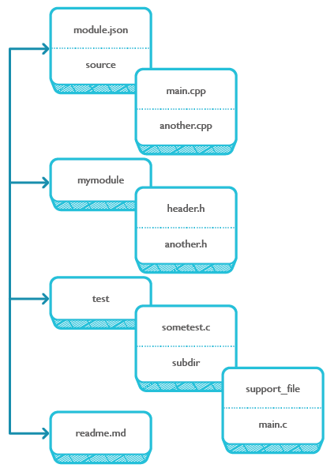
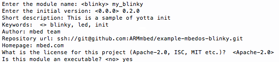
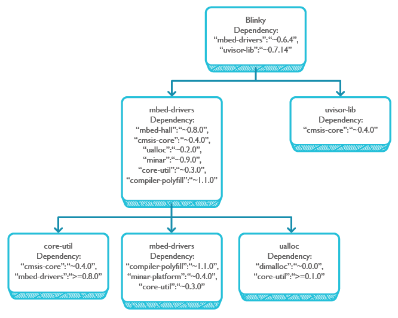

# Creating mbed OS applications with yotta

This chapter covers:

* [What a yotta executable - or mbed OS application - looks like](#mbed-os-applications-as-yotta-executables).

* [Initializing and building a project with yotta](#how-to-build-an-application).

* [Handling dependencies](#how-to-build-an-application).

<span style="background-color:#E6E6E6;  border:1px solid #000;display:block; height:100%; padding:10px">[You'll need to install yotta](../installation.md) to complete the examples in this chapter.</span>

## mbed OS applications as yotta executables

mbed OS applications are yotta executable modules, as opposed to yotta library modules. The [yotta documentation explains](http://yottadocs.mbed.com/tutorial/tutorial.html):

>> "There are two sorts of things that yotta builds: libraries, and executables. Libraries are reusable, and the source code for them is distributed in the yotta registry. Executables are stand-alone programs that depend on libraries, and which are not normally published themselves."

This chapter focuses on yotta executables, but much of its information is also relevant for libraries.

### Structure of a yotta module 

An application and a library have similar structures:

* A ``module.json`` file.

* A ``source`` directory containing source files to compile.

* A ``headers`` directory with the same name as the module.

* A ``test`` directory.

* A ``readme.md`` file summarizing the API of the module.


<span style="display:block; text-align:center; padding:5px; border:1px solid #000;">
</span>

**The ``module.json`` file** describes:

* The name, [semantic version](http://semver.org/) and license information of the module. 

* Any [dependencies](#installing-dependencies) that the module has. 

* Executable indication. If this is missing, the module is a library. The executable indication is the parameter ``bin``, which holds the subdirectory that yotta should build into an executable.

**The source directory** and any subdirectories contain the source files that yotta will automatically use to build the library. Source files in any other top-level directories will normally be ignored.

**The headers directory** should have the same name as your module and should contain all (and only) the public headers that your module exposes to anyone that depends on it. The name must be the same as your module name so that `#include` directives look like `#include "modulename/a_header.h"`, which prevents conflicts between multiple modules that have headers with the same name. This directory is optional for applications, since applications don’t normally export an interface that can be used by other modules.

**The test directory** contains source files and subdirectories to compile into tests. yotta strongly encourages writing tests for modules (and makes it really easy!), because thorough testing is an important part of making software truly reusable. Any source files at the top-level of the test directory will be compiled into separate test executables, and the (recursive) contents of any subdirectories will each be compiled into a single test executable. You can use the [`yotta test` subcommand](http://yottadocs.mbed.com/tutorial/testing.html) to automatically build and run these tests.

## Building an application

This section builds the sample application ``blinky``, which turns a LED on your board on and off. The build target is the [FRDM-K64F board](https://www.mbed.com/en/development/hardware/boards/freescale/frdm_k64f/) with the [gcc toolchain](https://launchpad.net/gcc-arm-embedded). You'll be using this sample several times in the guide, so it's well worth your time to build it.

### Overview

To build your application with mbed OS and yotta, you need to:

1. [Initialize a yotta module as an executable](#initializing-a-yotta-executable-module).

1. [Set a target](#yotta-targets).

1. [Install dependencies](#installing-dependencies).

1. [Add application files](#adding-project-code) to the ``source`` folder.

1. [Build the module](#building-the-module).


<span style="background-color:#E6E6E6;  border:1px solid #000;display:block; height:100%; padding:10px">**Tip:** When working with yotta in a command line prompt or terminal, you must navigate to your module directory before calling yotta.</span>

### Initializing a yotta executable module

If you have [yotta installed](../installation.md) on your computer, you can use ``yotta init`` to construct a new skeleton module in an empty directory by answering a simple series of questions. For example, here is how to initialize the [Blinky sample application](https://github.com/ARMmbed/example-mbedos-blinky):

<span style="background-color:#E6E6E6;  border:1px solid #000;display:block; height:100%; padding:10px">**Tip:** There is only one difference between initializing a library module and an executable module, and that is the selection between library and executable. You'll see soon where to make that selection.</span>

* Create a directory called ``blinky``. In a terminal or CMD, run:

	``user$ mkdir blinky``

* Navigate to the directory, because you need to call yotta from the directory in which you expect it to work:

	``user$ cd blinky``

* To initialize the module, run:

	``user$ yotta init``

* yotta begins to ask questions about the module. It offers a default answer for all questions; press Enter to accept the default, or input a different answer and press Enter. Please note:

 * "Enter the initial version": The default version is 0.0.0. You can use [``yotta version``](#Versioning-an-existing-yotta-module) to edit the version before every release.

 * "Is this an executable?": The default setting of a project is as a library. Please enter "yes" if your project is an executable. Only library modules can be reused by other modules and executables, so choose "no" if you're writing a reusable module.

 * "Keywords": Enter keywords with a comma between them. Keywords help people find your module, so they should describe what it does.

 * "Repository URL": This is where people can find your code to help improve your module or suggest changes. The default repository address is empty, and you may leave it like that. For a GitHub repository, note that you must use the SSH clone URL. In our example that is ``ssh://git@github.com:ARMmbed/example-mbedos-blinky.git``. The repository URL is for information purposes only; yotta doesn't download code from the repo.

 * "What is the license for this project": The default license is Apache-2.0, but you can enter a different one, such as ISC or MIT.

<span style="display:block; text-align:center; padding:5px;">
</span>

* When you've answered all of the questions, yotta creates the basic file structure you need. You can view it with the command ``ls``:

```
user$ ls
module.json	my_blinky	source		test
```

<span style="background-color:#E6E6E6;  border:1px solid #000;display:block; height:100%; padding:10px">**Tip:** You can use ``yotta init`` in an existing module to modify it at any time. Your previous answers are shown as the default, so you can edit only the ones that need to change; simply press Enter to accept the answers you don't want to change.</span>

### Versioning an existing yotta module

A yotta module's version structure is major.minor.patch, and the default for a new module is 0.0.0. The version is listed in the ``module.json`` file of your module.

As your project progresses, you will of course want to change versions. Please:

* Change the *major* if you have new functionality that is *not* backwards compatible.

* Change the *minor* if you have new functionality that is *fully* backwards compatible. 

* Change the *patch* if you have only backwards compatible bug fixes or changes that don't affect behavior, like whitespace edits.

To change the version:

1. Use ``yotta version`` to check the current version of your module.

1. Use ``yotta version <action>`` to bump the version number. The ``patch``, ``minor`` and ``major`` actions each increase the relevant part of the version number by 1, and set the less significant parts to zero. For example ``yotta version minor`` in a module with version ``1.2.3`` will increase the version number to ``1.3.0``:


```
user$ cd Blinky
user$ yotta version
info: @1.2.3 //current version of Blinky
user$ yotta version minor // new minor version (goes up by 1)
user$ yotta version
info: @1.3.0 // minor went up by 1, and patch changed to 0
```

You could also have used ``yotta version major`` for a major version (2.0.0) or ``yotta version patch`` for a patch version (1.2.4).

### yotta targets

<span style="background-color:#E6E6E6;  border:1px solid #000;display:block; height:100%; padding:10px">**Tip:** The full explanation for yotta targets is on the [yotta documentation site](http://yottadocs.mbed.com/tutorial/targets.html). Earlier in this document (that chapter will be published soon), you saw how yotta targets and the hardware implementation work together. This chapter explains only a couple of concepts and the basic yotta commands.</span>

yotta can build your code for different targets: different boards and operating systems. It can also use different compilers. This means you don't have to re-write code every time you want to test or deploy on a new kind of board. It also means you need to explicitly identify your target to yotta. Identifying a target means naming both the hardware and build toolchain you'll be using. The following sections explain how to work with targets.

#### Searching for targets

The yotta registry has a list of targets. You can search it using ``yotta search target <query>``:

```
yotta search target "k64f"
```

<span style="background-color:#E6E6E6;  border:1px solid #000;display:block; height:100%; padding:10px">**Tip:** You can use the ``--limit`` option to change the number of results displayed.</span>

Here are the top two results:

```
frdm-k64f-gcc 1.0.1:
    Official mbed build target for the mbed frdm-k64f development board.
    mbed-target:k64f, mbed-official, mbed, k64f, frdm-k64f, gcc
    
frdm-k64f-armcc 1.0.0:
    Official mbed build target for the mbed frdm-k64f development board, 
    using the armcc toolchain.
    mbed-target:k64f, mbed-official, mbed, k64f, frdm-k64f, armcc

```

Each target returns a name and a version, as well as a description. Note that the name includes a build toolchain - ``gcc`` or ``armcc`` - because a target description includes everything about how modules must be compiled to run on the target, including how to run the compiler.

#### Setting a target

The ``target`` command has two uses: to check what the current target is, and to set a new target.

* Used on its own, ``target`` tells you what the current target is. Since targets can depend on other targets, ``yotta target`` might list more than one target. In this case, the first target in the list is the actual build target and the rest are the targets from which the current build target inherits: 

```
yotta target
frdm-k64f-gcc 1.0.1
kinetis-k64-gcc 1.0.0
mbed-gcc 0.0.14
```

* Used with a target name, ``target`` sets a new target:

```
yotta target bbc-microbit-classic-armcc
```

#### Creating your own target

To learn about creating a new target, please see the [yotta documentation site](http://yottadocs.mbed.com/tutorial/targets.html).

### Module dependencies

mbed OS is structured as a set of modules. Each module declares which other modules it depends on. When you build a module, yotta looks at these dependencies and installs the necessary modules before completing the build.

This is also how you build applications for mbed OS: each application declares dependencies that are either mbed OS official modules, or modules created by the community or the developer to provide a specific functionality.

When you build your application, yotta downloads from the yotta Registry:

* Modules you listed in your ``module.json``.

* For each of the modules you listed, the other modules that module itself lists in its ``module.json``.

<span style="background-color:#E6E6E6;  border:1px solid #000;display:block; height:100%; padding:10px">**Note:** Because yotta downloads dependencies from the yotta Registry, you must be online the first time you build.</span>

#### mbed-drivers

We saw the [core modules mbed OS needs](../overview.md). Each of these modules depends on other modules. All mbed OS modules are available on the yotta Registry.

For example, here is a partial tree for **Blinky**. It shows Blinky's two dependencies: ``mbed-drivers`` and ``uvisor-lib``. Then it shows the start of the next level of dependencies: ``uvisor-lib`` has only one dependency, whereas ``mbed-drivers`` has several. These, in turn, have their own dependencies. And so on:

<span style="display:block; text-slign:center; padding:5px; border:1px solid #000;">
</span>

<span style="background-color:#E6E6E6;  border:1px solid #000;display:block; height:100%; padding:10px">**Note:** The list of dependencies for any application may change without warning; Blinky's changed while we were writing this chapter.</span>

Your dependencies are listed in the [``module.json``](#Structure-of-a-yotta-module) file for your module. Below, you can see how to list dependencies from the yotta Registry, GitHub and privately hosted sources.

##### module.json: dependencies from the yotta registry

To add dependencies from the yotta registry, list them in the ``module.json`` file by name and version:


```
  "dependencies": {
"mbed-drivers": "~0.8.3",
	"my_dependency": "^1.2.3"
  },
```

Selecting the dependency version:

* When you add a dependency to ``module.json``, you want to list the current version number, for example 1.2.3.

* In front of the version number, you can add a specifier (^ or ~, or even something like ">=1.2.3,<2.3.4") that controls version updates. It limits the versions yotta allows updates to when using ``yotta update``:
 * ^: Update to any semantic-version-compatible module (matching major version for >=1.x versions).
 * ~: Accept patch-version updates only.

Using ``yotta install <dependency_name>``, rather than manually editing ``module.json``, uses the correct version specifier automatically. So you can run ``yotta install mbed-drivers`` in your project's directory to automatically include ``mbed-drivers`` with a correct version

For modules with a 0.x version number, we recommend using ``~`` rather than ^. Even though semantic versioning specifies that any update may break compatibility, if you are using 0.x versions of something you're accepting some breakage anyway, and using ^ prevents you from getting any updates.

<span style="background-color:#E6E6E6;  border:1px solid #000;display:block; height:100%; padding:10px">**Tip:** For more information about versions and specifiers, see the [yotta documentation site](http://yottadocs.mbed.com/reference/module.html#dependencies).</span>

##### module.json: dependencies from GitHub repositories

You can use modules from GitHub repositories - private or public:


```
"dependencies": {"my_github_dependency": "username/reponame"}
```

yotta uses a shorthand for GitHub URLs. It has two parts: <user_name>/<repo_name>. For example, to include yotta itself:


```
"dependencies": {"yotta": "ARMmbed/yotta"}
```

yotta supports GitHub formats to specify branches and tags:

* ``username/reponame#<versionspec>``

* ``username/reponame#<branchname>``

* ``username/reponame#<tagname>``


##### module.json: dependencies from other sources


The yotta Registry and GitHub are the two methods we recommend, but we do support using git and mercurial directly.

The options are:

* git+ssh:``//example.com/path/to/repo``

* anything:``//example.com/path/to/repo.git``

* hg+ssh:``//example.com/path/to/repo`` (mercurial)

* anything:``//example.com/path/to/repo.hg`` (mercurial)

For example, to include a privately hosted git repository from ``example.com``:

```"dependencies": {"usefulmodule": "git+ssh://user@example.com:path/to/repo"}```

Git URLs support branch, version and tags specifications:

* git+ssh:``//example.com/path/to/repo#<versionspec, branch or tag>``

* anything:``//example.com/path/to/repo.git#<versionspec, branch or tag>``

Currently, mercurial URLs only support a version specification:

* hg+ssh:``//example.com/path/to/repo#<versionspec>``

* anything:``//example.com/path/to/repo.hg#<versionspec>``

#### Installing dependencies

When you have a dependency, you need to install it before you can build your own project. You need to do this from the module directory.

In the Blinky example, you need to install ``mbed-drivers``:

```
user$ cd blinky
user$ yotta install mbed-drivers
```

You need to be online for the installation to work, because yotta downloads the modules from the yotta Registry. 

### Adding project code

To complete the build:

1. Download the ``blinky.cpp`` file from the [example directory's ``source`` subdirectory](https://github.com/ARMmbed/example-mbedos-blinky/tree/master/source).

1. Save the file in the ``source`` directory under your own ``blinky`` directory.

1. Name the file ``main.`` 

You should now have:

	``/blinky/source/main.cpp``


### Building the module

The build command (like the target command) must be performed from within the directory of the module you're trying to build. It must also be performed after selecting a yotta target, as explained above. 

For example, if you're working with the ``blinky`` directory you created above:

```
user$ cd blinky
user$ yotta target frdm-k64f-gcc
user$ yotta build
```

The built executable (a binary) is created at ``./build/<target_name>/source/<module_name>``. So the result of that build is at ``blinky/build/frdm-k64f-gcc/source/``.

<span style="background-color:#E6E6E6;  border:1px solid #000;display:block; height:100%; padding:10px">**Tip:** Some targets require a HEX file, not a BIN. yotta knows which file type to build based on the target description.</span>

#### Flashing the application to the board

The file you need to flash onto the mbed-enabled board is ``my_blinky.bin``:

1. Connect the board to your computer using a micro-USB cable.

1. The board is shown as removable storage.

1. From your file explorer, drag and drop the file onto the board.

1. The application is now on your board and should start working immediately. Note that some boards need a reset.

## Building a project: summary

To build your ``blinky`` project with mbed OS and yotta, you:

1. Created a new directory and navigated to it in your Terminal or other command-line tool.

1. Initialized a yotta module:
	1. ``yotta init``.

1. Set a target:
	1. ``yotta search`` to search for one.
	1. ``yotta target <name_of_target>`` to set one.
	1. ``yotta target`` to check that the target was set.

1. Installed dependencies:
	1. ``yotta install mbed-drivers``.

1. Added application files to the ``source`` folder:
	1. File copied from the example GitHub repository and renamed ``main.cpp``.

1. Built the module:
	1. ``yotta build``.

1. Copied your binary to the board over micro-USB.

