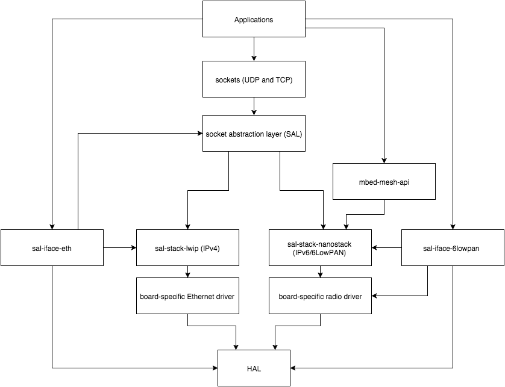

# Networking and connectivity
mbed OS provides several facilities for networking and connectivity.  For high level applications, mbed OS provides mbed Client, the C++ Socket API, and the BLE API.  mbed Client is a high level communication mechanism designed for working directly with mbed Device Server over CoAP. The C++ Socket API is a fully non-blocking, event-based, object-oriented socket API.  The BLE API is a C++ API for creating Bluetooth Low Energy applications.  These APIs abstract several protocols, including Ethernet, 6LoWPAN over 802.15.4, and Bluetooth Low Energy.

Using these three high level APIs, it is possible to create rich connected applications.

## Networking in mbed OS: the components

Networking in mbed OS is broken down into several components:

* The application.

* (optionally) The mbed Client API.

* The C++ Socket API.

* The Socket Abstraction Layer (SAL).

* The IP stack.

* The network driver.

* The network interface.
 
<span style="display:block; text-align:center; padding:5px; border:1px solid #000;"></span>

Some parts of this infrastructure are still in development but most of it is quite stable.

### The application

The application is the user's program. The application layer is responsible for:

* Initializing the IP stack (Note: when yotta supports module init, this requirement will be removed).

* Initializing the network interface.

* Sending data.

* Reacting to received data.

### The C++ Socket API

The C++ Socket API provides a number of state management facilities and convenience functions. The API also provides a mechanism for event demultiplexing, so that each class of event is dispatched to a separate handler. The C++ Socket API is built on top of the MINAR scheduler. This means that C++ Socket API callbacks do not execute in IRQ context, so complex computations, memory allocation and so on will not interfere with interrupt processing. More information on using the C++ socket API can be found in the sockets readme.

The C++ Socket API is built on top of the Socket Abstraction Layer.

__Known issues__

Currently the C++ Socket API is responsible for scheduling the periodic callback of each underlying stack. However, it only supports calling the periodic callback of a single stack and so does not support two coexisting IP stacks.

### The Socket Abstraction Layer

The Socket Abstraction Layer (SAL) provides a common C interface to all of the common features that an IP stack provides. Much of the SAL is implemented as wrappers around the structures provided by IP stacks. Some features of the SAL require that data types be converted to and from IP stack structures. The primary example of this is the ```struct socket_addr```: this structure is implemented as a 128-bit big-endian integer. This is so that the SAL can treat all IP addresses the same way, and so that the application can have some guarantees about how it accesses the IP addresses. In most stacks, the IP address is stored as a big-endian integer anyway, so this creates very little overhead.

Typically, applications will not use SAL APIs directly. While it is possible to do this, the C++ Socket API provides a much more convenient interface, with very little overhead.

The SAL has been designed to support multiple, coexisting IP stacks, running simultaneously. However, this feature is not currently supported by the C++ Socket API. The SAL is configured to use a maximum of two IP stacks. In a future version of the SAL, it will be possible to change the number of supported stacks.

#### SAL development

The SAL is not complete: an interface abstraction API is still in development. This abstraction is necessary because the stack needs to know about network interface state changes; it also needs to do IP address configuration, either through static configuration or through DHCP. Because these configuration options are largely stack-level, they require an API to control the stack, so the SAL forms a natural interface point.

#### SAL dependencies

The SAL contains very little code - it is mostly a set of API definitions. The SAL depends on an IP stack to implement its APIs. The IP stack is selected via the [yotta config mechanism](http://yottadocs.mbed.com/reference/config.html).

For example, when using a Freescale FRDM-K64F, LwIP is enabled by default.  If 6LoWPAN is the target for the application, then application-level config can override this choice in an application-supplied ```config.json```:


```JSON
{
 "mbed-os": {
  "net": {
   "stacks": {
    "lwip":false,
    "nanostack": true
   }
  }
 }
}
```

### The IP stack

The IP stack is typically wrapped with a lightweight shim that implements the APIs of the SAL. Currently, there are two supported stacks: LwIP (IPv4 only), and nanostack (IPv6 only).

Please note that some mbed C++ Socket API methods may not be available for the selected IP stack. Therefore, it is important to check the API method return value.
### The network driver

This component provides the IP stack with the interface it needs to control the hardware. One driver is required for each combination of IP stack and network hardware.

### The network interface

The network interface provides management functions for the interface hardware, such as power up/down and configuration. It is currently bound to the IP stack, but future development of the SAL will permit the network interface to be decoupled from the IP stack.


### Examples

There are several complete examples provided in [mbed-example-network](https://github.com/ARMmbed/mbed-example-network).  In addition to these examples, a plain DNS resolution is provided below.

#### DNS example

This is a simple example of resolving an address with DNS:

```C++
#include "sockets/v0/UDPSocket.h"
#include "sal-stack-lwip/lwipv4_init.h"
#include "sal-iface-eth/EthernetInterface.h"
using namespace mbed::Sockets::v0;
class Resolver {
private:
    UDPSocket _sock;
public:
    Resolver() : _sock(SOCKET_STACK_LWIP_IPV4) {
        _sock.open(SOCKET_AF_INET4);
    }
    void onDNS(Socket *s, struct socket_addr addr, const char *domain) {
        (void) s;
        SocketAddr sa;
        char buf[16];
        sa.setAddr(&addr);
        sa.fmtIPv4(buf,sizeof(buf));
        printf("Resolved %s to %s\r\n", domain, buf);
    }
    socket_error_t resolve(const char * address) {
        printf("Resolving %s...\r\n", address);
        return _sock.resolve(address,
        	UDPSocket::DNSHandler_t(this, &Resolver::onDNS));
    }
};

EthernetInterface eth;
Resolver *r;
void app_start(int argc, char *argv[]) {
    (void) argc;
    (void) argv;
    static Serial pc(USBTX, USBRX);
    pc.baud(115200);
    printf("Connecting to network...\r\n");
    eth.init();
    eth.connect();
    printf("Connected\r\n");
    lwipv4_socket_init();
    r = new Resolver();
    r->resolve("mbed.org");
}

```


## IPv6 (6LoWPAN)

6LoWPAN stack is a robust, scalable and self-healing mesh networking stack for low power, less complex constrained devices. The 6LoWPAN stack [ documentation](http://docs.mbed.com/docs/arm-ipv66lowpan-stack/en/latest/) is giving overview of the 6LoWPAN technology and reference to 6LoWPAN stack C API.

In mbed OS, the 6LoWPAN stack which is written in C language, should be used via [mbed-mesh-api](https://github.com/ARMmbed/mbed-mesh-api) and [mbed C++ Socket API](https://github.com/ARMmbed/sockets/blob/master/README.md). The mbed-mesh-api is responsible for initializing the 6LoWPAN stack when used for the first time and therefore application must connect to wireless network by using the mbed-mesh-api before using any methods from the socket API.

The mbed C++ Socket API is not fully supported by 6LoWPAN adaptation layer. To see 6LoWPAN stack deviations from the mbed Socket C++ API please see readme in [sal-iface-6lowpan](https://github.com/ARMmbed/sal-iface-6lowpan).

The mbed-mesh-api is in experimental state, it is using static configuration. It does not provide API for selecting the node operating mode, security option, radio channel or other options that are needed for connecting to 6LoWPAN network. Support for these configurations will be available later.

## Thread

Thread support is built-in to the 6LoWPAN stack. See [Introduction to Thread](https://docs.mbed.com/docs/arm-ipv66lowpan-stack/en/latest/thread_overview/index.html) for more information.

## Bluetooth Low Energy (BLE)

Will be published soon.

## Including networking headers in your code

All mbed OS applications need ``mbed-drivers``, which includes most mbed OS functionality. However, for networking, you will have to explicitly include additional headers.

__For IPv4:__

```c++
#include "sal-iface-eth/EthernetInterface.h"
#include "sockets/UDPSocket.h" //if you want UDP
#include "sockets/TCPStream.h" //if you want a TCP Client
#include "sockets/TCPListener.h" //if you want a TCP Server
#include "sal-stack-lwip/lwipv4_init.h"
```

And please ensure that you have the following call in your code:

```c++
void app_start(int argc, char *argv[])
{
    socket_error_t err = lwipv4_socket_init();
   ...
}
```

__For 6LoWPAN and Thread:__

```c++
#include "mbed-mesh-api"
#include "mbedclient.h"
#include "sockets.h" // if you are using network modules other than mbed Client.
```

You might need to include board specific drivers, for example ``#include "atmel-rf-driver"``.

__For BLE:__

```c++
#include "ble/BLE.h"
#include "ble/services/iBeacon.h" // If you're using a standard service, include its header
```

__module.json updates__

You will need to add these dependencies to your project's ``module.json`` file. The following example shows includes for 6LoWPAN:

```json
"dependencies": {
	"mbed-drivers": "*",
	"mbed-client": "^1.0.0",
	"atmel-rf-driver": "^1.0.0",
	"mbed-mesh-api": "^1.0.0"
}
```

And these are for BLE:

```json
"dependencies": {
	"mbed-drivers": "*",
	"ble": "^2.0.0" 
}
```
